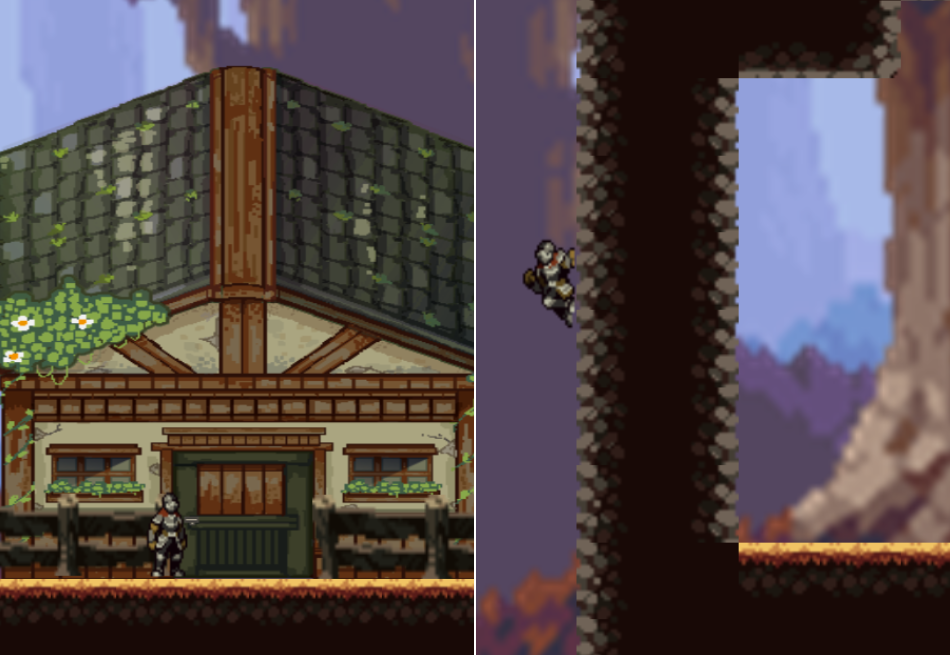
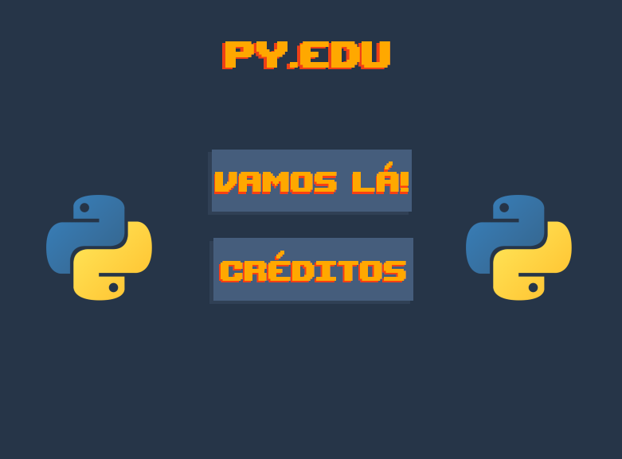
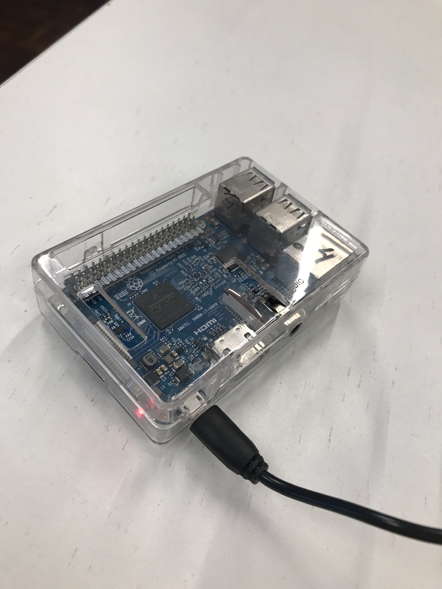
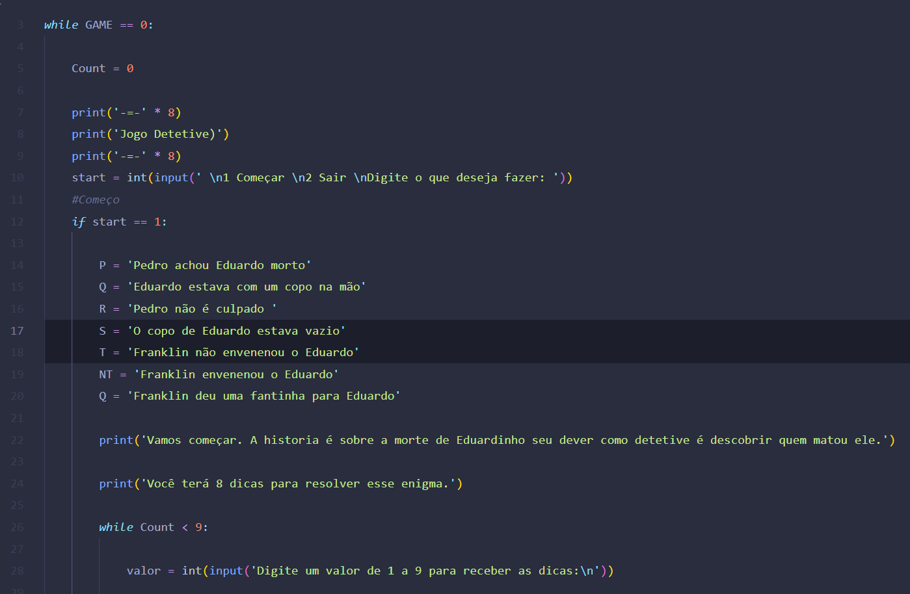

## Sobre Mim
Sou estudante de Ciência da Computação da Computação na PUCPR(Pontifícia Universidade Católica do Paraná), finalizei o curso técnico na TECPUC, e sempre procuro aprender mais sobre tecnologia em geral.

## Projetos
Aqui você vai encontrar alguns dos projetos que realizei durante o decorrer do meu curso.

### Experiência Criativa
**Generiknight** é um jogo de plataforma onde o cavaleiro deve resgatar seu irmão sequestrado por um culto maligno, com planos maléficos.
   O projeto foi feito a partir do Construct 2.  

---

**PY.EDU** é um projeto feito no Processing, com a linguagem Java, com o intuito de criar um quiz sobre a linguagem de programação Python.

 

---

O **Site de cinema** é um projeto no qual você pode adicionar filmes que conhece ou consultar informações sobre filmes de uma lista predefinida, além de poder aprender sobre a história do cinema.

---

### Raciocínio Algorítimo
**O Jokenpô** é um de pedra, papel e tesoura, que conta com o modo JOGADORxJOGADOR e JOGADORxCOMPUTADOR.

O **Jogo da Memória** consiste em apresentar pares de desenhos distribuídos em quadrantes e o jogador deve adivinhar as posições que apresentam desenhos iguais

---

### Fundamentos de Sistemas Ciberfísicos
O **Projeto Smart City** se reunia em criar a proposta de uma solução aplicada a Smart City, utilizando o Raspberry Pi e sensores/atuadores.

  

---

### Resolução de Problemas com Lógica Matemática
O **Jogo do Detetive** consiste em um jogo onde deve se usar regras de inferências, para deduzir a conclusão criada pelos alunos.

  

